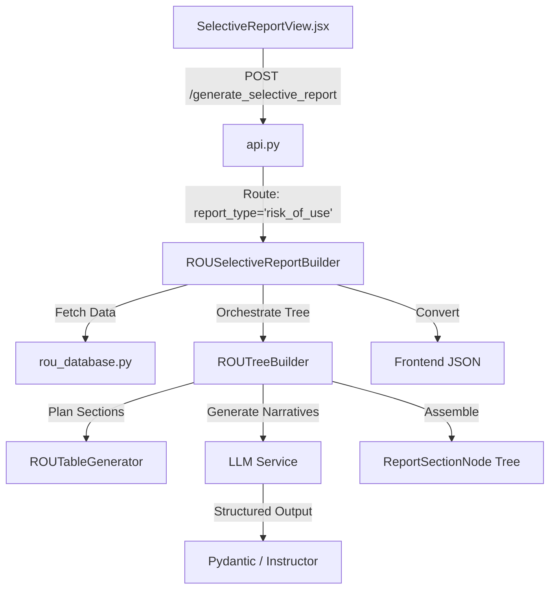
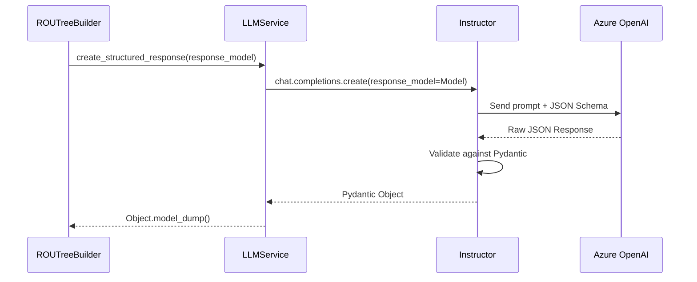

# Risk of Use (RoU) Document Builder: LLM Integration Analysis

This document provides a deep-dive analysis of the LLM orchestration, Pydantic schemas, and Instructor usage within the Risk of Use (RoU) report generation module.

## 1. Architecture Overview

The RoU report generation follows a **Hybrid Builder Pattern**. It combines deterministic Python-based table generation with LLM-powered narrative sections.



## 2. LLM Call Implementation Analysis

### 2.1 Orchestration & Parallelism
The core logic resides in `ROUTreeBuilder.py`. It uses `asyncio` for non-blocking execution and implements a concurrency cap to manage API rate limits.

*   **Concurrency Control:** `MAX_CONCURRENT_LLM = 5`.
*   **Execution Pattern:** Sections are built sequentially in the current core flow, but granular narrative tasks can be gathered using `gather_with_limit`.
*   **Timeouts:** Enforced via `timeout_with_fallback` (Default: 60 seconds).

### 2.2 Detailed LLM Inventory

Currently, the RoU builder implements one primary LLM entry point for the **Executive Narrative**.

#### A. RoU Executive Summary Narrative
*   **Trigger:** `ROUTreeBuilder._generate_rou_executive_narrative()`
*   **Target Method:** `llm.generate_risk_assessment` (Note: Currently points to a deprecated method in `llm_service.py`, requiring migration to `create_structured_response`).

**Call Specification:**

| Component | Detail |
| :--- | :--- |
| **System Prompt** | "Analyze the following Risk of Use (RoU) data for trademark attorney use." |
| **User Input** | Applicant Mark, Number of citations, Highest risk score, and top 10 matches. |
| **Pydantic Schema** | *Targeting Migration to:* `OpinionNarrativesResult` |
| **Expected Output** | A concise 3-sentence summary focus on litigation risk across multi-source data. |

**Code Proof (`ROU_tree_builder.py:L191-212`):**
```python
prompt = f"""
Analyze the following Risk of Use (RoU) data for trademark attorney use.
Applicant Mark: {search_ctx.get('Mark_Searched')}
Number of citations analyzed: {len(matches)}
Highest risk score identified: {data['overall_metrics']['max_score']}

Provide a concise 3-sentence summary focus on litigation risk across multi-source data.
"""

result = await timeout_with_fallback(
    llm.generate_risk_assessment(...),
    timeout_seconds=self.LLM_TIMEOUT,
    fallback="RoU narrative generation unavailable.",
)
```

## 3. Pydantic & Instructor Integration

While the current RoU builder uses a legacy text-based call (which is effectively a bug due to `generate_risk_assessment` removal), the **Standard Selective Report Builder** (`selective_report_builder.py`) provides the blueprint for the required RoU migration.

### 3.1 Instructor Workflow
Instructor wraps the OpenAI client and uses Pydantic to enforce schema compliance.



### 3.2 Target Schemas for RoU
The following schemas from `src/llm_contracts.py` are utilized or targeted for RoU reports:

1.  **SelectiveExecutiveContentResult:** Used for high-level risk assessment.
    *   Fields: `narrative`, `business_impact`, `registration_prediction`, `regulatory_check`, `recommended_actions`.
2.  **SelectiveTrademarkAnalysisResult:** Used for individuated citation analysis.
    *   Fields: `analysis`, `mitigation_strategy`.

## 4. Discovery: Critical Namespace Discrepancy

During analysis, a discrepancy was identified in `src/llm_service.py`. The `generate_risk_assessment` method was recently removed as part of "obsolete features cleanup" (Line 1284).

> [!WARNING]
> **Implementation Gap:** `ROU_tree_builder.py` and `tree_builder.py` both attempt to call `llm.generate_risk_assessment()`. Since this method no longer exists in `LLMService`, report generation will default to fallback text or fail until migrated to the structured `generate_selective_report` or `create_structured_response` pipeline.

## 5. Summary of LLM Operations

| Task | Scope | Input Data | Output Type | Validation |
| :--- | :--- | :--- | :--- | :--- |
| **Exec Narrative** | Report-wide | Context + Matches | String/JSON | Pydantic (Target) |
| **Citation Analysis** | Per Citation | TM + Goods + Risk | JSON | Instructor |
| **Recommendations** | Final Table | Risk Metrics | List[str] | Heuristic + LLM |
